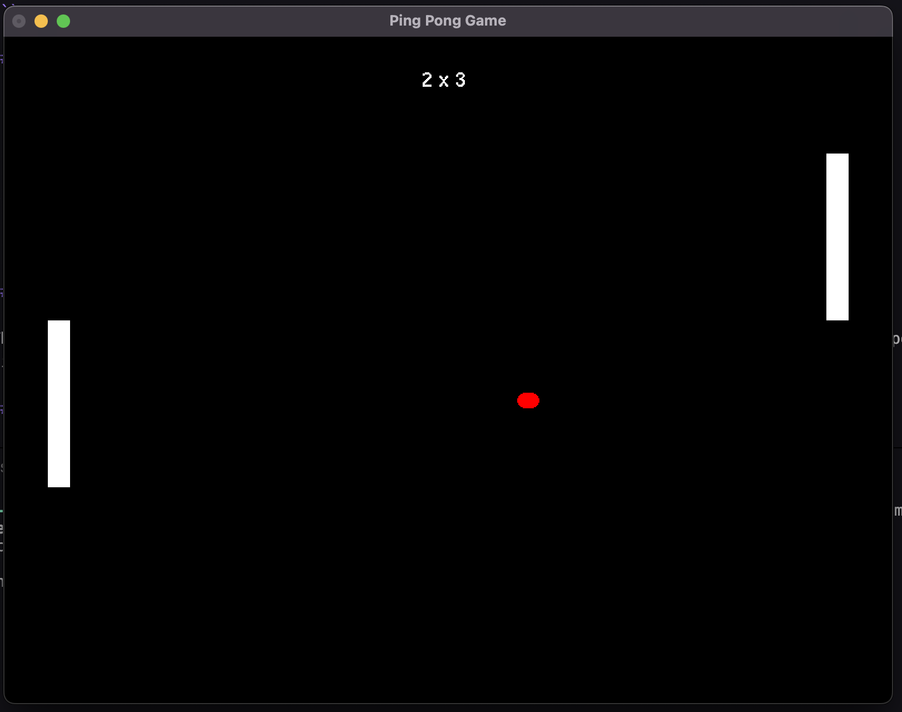

# Ping Pong Game with OpenGL 🏓

This project implements a simple Ping Pong game using OpenGL and GLUT.



## Dependencies

Make sure you have the following dependencies installed:

- OpenGL
- GLUT (OpenGL Utility Toolkit)

## Compilation and Execution

### Compiling on macOS 🍎

Use the following command to compile the project on macOS:

```bash
clang++ -framework OpenGL -framework GLUT -o ./bin/main src/main.cpp src/game.cpp && ./bin/main
```

### Compiling on Linux (example) 🐧

For Linux, you may need to adjust the command depending on your OpenGL and GLUT setup:

```bash
g++ -o ./bin/main src/main.cpp src/game.cpp -lGL -lGLU -lglut && ./bin/main
```

### Compiling on Windows (example) 🖥️

On Windows, you can compile using MinGW or another compatible compiler:

```bash
g++ -o ./bin/main.exe src/main.cpp src/game.cpp -lopengl32 -lglu32 -lglut32 && ./bin/main.exe
```

## Controls 🎮

- Player 1:
  - `W`: Move up
  - `S`: Move down

- Player 2 (if applicable):
  - Arrow Up: Move up
  - Arrow Down: Move down

## Gameplay 🕹️

The game features two players controlling paddles to bounce a ball back and forth. Players earn points when the opposing player misses the ball.

## Files and Structure 📂

```
.
├── README.md
├── assets
├── bin
│   └── main
└── src
    ├── game.cpp
    ├── game.h
    └── main.cpp

4 directories, 5 files
```